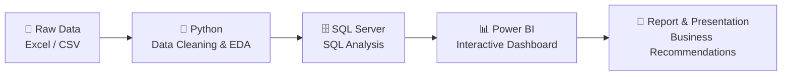

# 📊 Customer Shopping Behavior Analysis

> **End-to-End Customer Behavior Data Analytics Project**  
> From raw data to business insights using Python, SQL, Power BI, and storytelling.

[](https://www.python.org/)
[](https://www.microsoft.com/en-us/sql-server)
[](https://powerbi.microsoft.com/)
[](https://jupyter.org/)
[](#)
[](#)
[](#license)

---

## 📌 Table of Contents

- [🧠 Project Overview](#project-overview)
- [🎯 Project Objective](#project-objective)
- [👥 Target Audience](#target-audience)
- [🔄 Project Workflow](#project-workflow)
- [🛠️ Technologies Used](#technologies-used)
- [📂 Project Structure](#project-structure)
- [📋 Project Contents](#project-contents)
- [🚀 Getting Started](#getting-started)
- [📊 Dashboard Preview](#dashboard-preview)
- [📈 Results & Insights](#results--insights)
- [💡 Business Recommendations](#business-recommendations)
- [📄 Report & Presentation](#report--presentation)
- [📬 Contact](#contact)
- [📜 License](#license)

---

## Project Overview

This project represents a complete, industry-standard, **end-to-end data analytics workflow** designed to simulate the responsibilities of a professional data analyst in a modern business environment.

The project covers the key stages of the analytics process, from data preparation and exploration to SQL-based analysis, interactive visualization, insight generation, reporting, and business recommendations.

It is designed for:

- 📊 **Data Analyst aspirants** building a strong portfolio project for interviews and LinkedIn.
- 📚 **Learners** developing practical skills in Python, SQL, and Power BI.
- 💼 **Professionals** preparing for roles and interviews in Data Analytics, Data Science, and Product Analytics.

---

## Project Objective

The goal of this project is to simulate a corporate-grade, end-to-end data analytics workflow and demonstrate the ability to transform raw data into meaningful business intelligence through multiple analytical stages:

- 🐍 **Data Preparation, Modeling & Exploratory Data Analysis (Python):** Clean, transform, explore, and prepare the raw dataset for analysis.
- 🗄️ **Data Analysis (SQL):** Load the data into a SQL database and use SQL queries to analyze customer segments, customer loyalty, and purchase drivers.
- 📊 **Visualization & Insights (Power BI):** Build an interactive dashboard that highlights important patterns and trends and supports data-driven decision-making.
- 📄 **Reporting & Presentation:** Document the key findings and business recommendations in a project report and prepare a presentation that communicates insights and actionable recommendations to stakeholders.

---

## Target Audience

This project is suitable for:

| Audience | Benefit |
| --- | --- |
| 📊 Data Analyst Aspirants | Build a professional portfolio project for interviews and LinkedIn |
| 📚 Data Analytics Learners | Practice Python, SQL, and Power BI in one complete workflow |
| 💼 Job Seekers | Prepare for Data Analytics, Data Science, and Product Analytics roles |
| 🧠 Product & Business Analysts | Understand customer behavior, loyalty, and purchase drivers |

---

## Project Workflow



**Workflow Summary:**

**Raw Data → Data Preparation → Analysis → SQL Insights → Dashboard → Business Recommendations**

---

## Technologies Used

| Technology / Format | Purpose |
| --- | --- |
| 🐍 Python | Data preparation, cleaning, exploration, and analysis |
| 🗄️ SQL Server | Database storage and SQL-based analysis |
| 📊 Power BI | Interactive data visualization and dashboard development |
| 📁 Excel / CSV | Source data format |
| 📓 Jupyter Notebook | Python analysis environment |
| 📽️ Gamma AI | Presentation deck creation |

---

## Project Structure

```text
Customer-Shopping-Behavior-Analysis/
│
├── Customer_Shopping_Behavior_Analysis.ipynb   # Python notebook: cleaning, EDA, SQL connection
├── customer_behavior_sql_queries.sql           # SQL business questions and analysis queries
├── customer_behavior_dashboard.pbix            # Power BI interactive dashboard
├── data/                                       # Raw and prepared data files
├── reports/                                    # Project report and presentation
│   ├── project_report.pdf
│   └── presentation.pdf
├── images/                                     # Dashboard screenshots and visuals
│   └── dashboard_preview.png
└── README.md
```

> Adjust folder names if your actual repository structure is different.

---

## Project Contents

### 1. Python Data Analysis

Open:

```bash
Customer_Shopping_Behavior_Analysis.ipynb
```

The notebook covers:

- ✅ Data Import
- ✅ Data Exploration
- ✅ Data Cleaning
- ✅ Connection to the SQL Database

### 2. SQL Database & Analysis

Load the prepared data from the Python notebook into the SQL database.

The workflow includes:

- ✅ Creating the SQL database
- ✅ Loading the data into the database using Python
- ✅ Opening `customer_behavior_sql_queries.sql`
- ✅ Answering business questions using SQL queries

### 3. Power BI Dashboard

Connect the SQL database to Power BI.

The workflow includes:

- ✅ Opening `customer_behavior_dashboard.pbix`
- ✅ Connecting Power BI to the SQL database
- ✅ Creating an interactive dashboard
- ✅ Visualizing important customer behavior patterns and trends

### 4. Project Report & Presentation

The project also includes:

- ✅ Creating a project report
- ✅ Preparing a presentation deck using Gamma AI

---

## Getting Started

### Prerequisites

Before running this project, make sure you have:

- 🐍 Python 3.x
- 📓 Jupyter Notebook
- 🗄️ SQL Server
- 📊 Power BI Desktop
- 📁 Excel / CSV viewer

### Steps

1. **Clone the repository**

```bash
git clone https://github.com/your-username/Customer-Shopping-Behavior-Analysis.git
cd Customer-Shopping-Behavior-Analysis
```

2. **Open the Python notebook**

```bash
jupyter notebook Customer_Shopping_Behavior_Analysis.ipynb
```

3. **Run the notebook**

Execute the cells to:

- Import the data
- Explore and clean the data
- Prepare the dataset
- Connect to the SQL database

4. **Load the data into SQL Server**

Use the connection steps in the notebook to load the prepared data into your SQL database.

5. **Run SQL queries**

Open:

```bash
customer_behavior_sql_queries.sql
```

Run the queries to answer business questions about customer segments, loyalty, and purchase drivers.

6. **Open the Power BI dashboard**

Open:

```bash
customer_behavior_dashboard.pbix
```

Connect Power BI to your SQL database and explore the interactive dashboard.

7. **Review the report and presentation**

Check the `reports/` folder for the project report and presentation deck.

---

## Dashboard Preview


> 📸 Replace this image with an actual screenshot of your Power BI dashboard.

---

## Results & Insights

> ✍️ Add your key findings here after completing the analysis.

Suggested areas to summarize:

- 🧩 Customer segments and their behavior
- 🔁 Customer loyalty patterns
- 🛒 Main purchase drivers
- 📈 Trends and opportunities
- 🎯 Factors influencing repeat purchases

---

## Business Recommendations

> ✍️ Add your data-driven recommendations here.

Possible recommendation areas:

- 🎯 Targeted marketing campaigns for high-value customer segments
- 💳 Loyalty programs to improve retention
- 🛍️ Product placement and promotion based on purchase drivers
- 📊 Dashboard monitoring for ongoing customer behavior tracking

---

## Report & Presentation

| Deliverable | File |
| --- | --- |
| 📄 Project Report | `reports/project_report.pdf` |
| 📽️ Presentation Deck | `reports/presentation.pdf` |

> If these files are not ready yet, remove this section or mark it as **Planned**.

---

## Contact

[](https://www.linkedin.com/in/your-profile)
[](https://github.com/your-username)
[](mailto:your.email@example.com)

---

## License

This project is intended for **educational and portfolio purposes**.

You can add an MIT License if you want to make it open-source:

```text
MIT License
```

---

## ⭐ Support

If you found this project useful, please consider giving it a ⭐ on GitHub.
